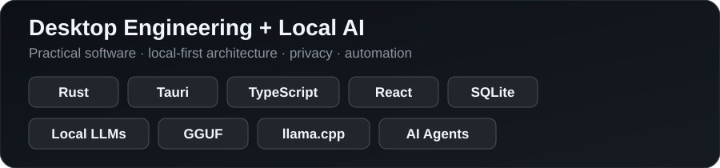

# Hi, I'm Daniele 👋

### IT Technical Assistant · Desktop Apps · Local AI

I build practical software focused on **desktop applications, local-first architectures, AI integration, privacy and workflow automation**.

A significant part of my current development work lives in private repositories. I keep source code private where the project context requires it, while presenting non-sensitive technical information here.

---

## 🚀 Selected Work

### ✍️ Romanziere Studio

Local-first desktop software for structured writing and AI-assisted creative workflows.

**Focus:** desktop engineering · local data · local AI · structured workflows  
**Stack:** `Rust` · `Tauri` · `React` · `TypeScript` · `SQLite` · `llama.cpp` · `GGUF`

🟢 **Active development**

---

### 🛡️ Administrative Workflow Application

Desktop application prototype focused on structured local workflows, access control, traceability and data integrity.

**Stack:** `Rust` · `Tauri` · `React` · `TypeScript` · `SQLite` · `Windows`

🟢 **Active prototype / internal R&D**

> Operational details and real-world data remain private by design.

---

### 📖 Digital Reading Experiments

Experimental projects exploring modern reading interfaces, EPUB workflows and component-based frontend design.

**Stack:** `React` · `TypeScript` · `Vite` · `EPUB.js` · `Tailwind CSS`

🟡 **Experimental development**

---

## 🧪 Open Source Experiments

### 🎵 [K.G.Studio](https://github.com/danielevex/K.G.Studio)

Public fork of **KGAudioLab/K.G.Studio**, used as an experimental environment for studying AI-assisted music software, MIDI workflows, local agents and modular audio architecture.

> This repository is a fork. Original upstream work belongs to its respective authors.

---

## 🔐 Private repositories, visible activity

Private repositories are used when a project contains work-related context, experimental intellectual property or material that should not be published openly.

**Activity from private repositories is included in my GitHub contribution graph**, while repository names and contents remain private.

Where confidentiality permits, architecture, demonstrations and selected technical details can be discussed during an evaluation.

---

## 📈 What I'm building toward

I'm concentrating on complete, practical applications rather than isolated coding exercises.

**Desktop applications → Local AI → Agent architectures → Secure/offline workflows → Useful software**

---

**GitHub:** [@danielevex](https://github.com/danielevex)
